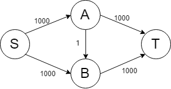
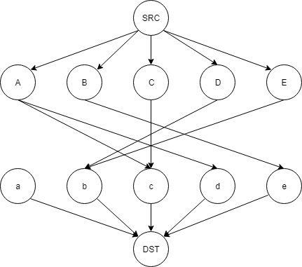

# 11. Network

Outline
1. AOE Network
2. Network Flow
3. Network Flow : Implement
4. Application : Graph Matching

## 1. AOE Network
- Start of Network -> Activity on edge(AOE Network) : 특정 vertex에서 다른 vertex로 갈떄까지 weight의 최소값 혹은 최대값을 얻을 수 있다.
- 최소 : 최소 경로를 만지작거리는건 거의 의미가 없어서 어지간해선 안 구한다. 단, 최소 경로와 최대 경로가 서로 가까울수록 최적화가 잘 된 그래프라 보면 됨.
- 최대 : 임계 경로(critical path) -> 특정 edge의 weight의 변화는 임계 경로에 영향을 못 미칠수도 있다.

### Graph
- 서로 아예 연관이 없는 작업
  1. weight를 0으로 설정하고 연결
  2. 그냥 그래프를 끊어버린다.
- 선행 작업 : edge에서 source 부분에 해당하는 vertex는 destination에 해당하는 vertex의 선행 작업이다.
  - 특정 vertex로 향하는 edge가 많을 경우, 해당 작업은 여러 개의 선행 작업을 가지고 있다고 생각하면 됨.
- 후행 작업 : edge에서 destination 부분에 해당하는 vertex는 source에 해당하는 vertex의 후행 작업이다.

### Algorithm : Earliest & Latest
- Psuedo Code : **Earliest** <-> topological
  1. max value of (Earliest(X) + <X,Y> weight) where X node directly indicates Y node(for all X nodes)
     - 시작점에서 x vertex로 도달할 때 필요한 최소값
- Psuedo Code : **Latest** <-> reverse topological
  1. min value of (Latest(Y) - <X,Y> weight) where X node directly indicates Y node(for all X nodes)
     - 도착점에서 x vertex로 도달할 때 필요한 최소값

### Algorithm : AOE
- Psuedo Code : **Activity of Edge** 
  1. calculate **Early case** and **Late case** for all of vertex
     - Early case(<x,y>) : Earliest(x)
     - Late case(<x,y>) : Latest(y) - Edge(<x,y>)
  2. if(Late case == Early case ) : reduction in the total times if any weight of edges on path decreased
  3. else if(Late case >= Early case) : no reduction in the total times if any weight of edges on path decreased
- 만약 early case와 late case가 서로 같다면, 해당 부분의 작업이 아직 완료되지 않아서 다른 부분의 작업을 이어 수행할 수 없다는 의미로 해석할 수 있다.
     
  - 만약 H라는 작업이 전부 수행됬다고 해도(max weight : 11) J라는 작업은 G가 수행되기 전(max weight : 15)까지 진행하지 못한다. 이때, G의 Early case와 Late case는 15로 동일하며, A-G 경로의 weight 값을 조정해 다른 작업이 대기하는 시간을 감소시킬 수 있다.
  - 이에 반해 I의 경우 Early case는 10, Latest case는 15이므로 A-I 경로의 weight값을 조정해도 Late case(G)가 완료될때까지 대기해야한다. 따라서 해당 경로의 weight를 감소시켜도 총 요구 weight의 값은 변화하지 않는다.

### Code

## 2. Network Flow
- Residual Network <-> Less Net : 가장 최신 알고리즘(SOTA)에 가장 많이 쓰는 방법. 반드시 알아두자.
- 각 vertex마다 차이를 인지, 이를 저장한다.(r(x,y) = c(x,y) - f(x,y))
- BFS 기반
- augmenting path를 찾아 parent에 저장 -> 해당 데이터를 기반으로 Residual Network를 갱신한다.
- 강의 노트 내에 화살표가 다른게 많음. 주의하자.
- MAX FLOW -> 19 + 4 = 23
- **CAPACITY** : orignal graph
- **FLOW** : Offset(capacity-residual)
- **Residual** : result!
### Ford-Fulkerson Algorithm
1. Residual Network 구하기
2. Residual Network 내에서 Augmenting Path(확대 경로) 찾기
3. Augmenting Path 상에서 minimum weight를 역방향으로 흘려주고(flow), Residual Network를 Update.
   - minimum weight을 활용하는 이유는? : 나머지 edge가 더 큰 가중치를 가지고 있다고 해도 minimum weight를 가진 edge가 버틸 정도로만 flow를 내보내야 한다.
4. Augmenting Path가 더이상 찾아지지 않을때까지 1~3을 반복
- 단점 : 다음과 같은 경우, 최대 2000번을 수행한다.
     
     ```text
     SABT -> SBAT -> SABT -> SBAT -> ...
     ```
  - 어떤 경로가 최적의 augmenting path인지 모른다 -> worst case가 한없이 효율이 나빠질 수 있다.

### Code
- base function
     ```c
     #define _CRT_SECURE_NO_WARNINGS

     #include<stdio.h>
     #include<stdlib.h>
     #define SRC 'S'
     #define SINK 'T'
     #define MAX_NODE 100
     // residual : residual 그래프 저장
     // capacity : 본래 그래프 저장
     // flow : capacity -> residual의 오차값을 저장
     int capacity[MAX_NODE][MAX_NODE]; // for capacity
     int flow[MAX_NODE][MAX_NODE]; // for flow
     int residual[MAX_NODE][MAX_NODE]; // for residual network
     int check[MAX_NODE]; // for checking the visit
     int parent[MAX_NODE]; // for bfs-based tree
     int path[MAX_NODE];	// for augmenting path
     int queue[MAX_NODE];
     int front;
     int rear;
     //-------------name <-> integer---------------------
     // src와 dst에 대해 src = 0, dst(sink) = 1으로 가정한다.
     int name2int(char c) {
          if (c == SRC) return 0;
          if (c == SINK) return 1;
          return c - 'A' + 2;
     }

     int int2name(int i) {
          if (i == 0)return SRC;
          if (i == 1) return SINK;
          return i + 'A' + 2;
     }
     //---------------------------------------------------
     //----------- queue ------------
     void init_queue() {
          front = rear = 0;
     }

     int queue_empty() {
          if (front == rear)
               return 1;
          return 0;
     }

     void put(int k) {
          queue[rear] = k;
          rear = ++rear%MAX_NODE;
     }

     int get() {
          int i;
          i = queue[front];
          front = ++front % MAX_NODE;
          return i;
     }
     //--------------------------------
     //--------------------------- path --------------------------------
     int get_augment_path(int a[][MAX_NODE], int V, char src, char dst);
     // 경로 구하는 함수
     void reverse_path();
     // 구한 경로를 역방향으로 저장하는 함수
     //-----------------------------------------------------------------
     //----------------------------------- construct ----------------------------------------
     void construct_residual(int c[][MAX_NODE], int f[][MAX_NODE], int r[][MAX_NODE], int V);
     // capacity matrix와 flow matrix를 활용해 residual matrix 갱신
     //--------------------------------------------------------------------------------------
     //------------------------------------------ API -----------------------------------------------
     void network_flow(int c[][MAX_NODE], int f[][MAX_NODE], int r[][MAX_NODE], int V, int src, int dst);
     // flow matrix 갱신
     //----------------------------------------------------------------------------------------------
     ```
- **API**
     ```c
     void network_flow(int c[][MAX_NODE], int f[][MAX_NODE], int r[][MAX_NODE], int V, int src, int dst) {
          int i, min;
          
          clear_matrix(f, V);
          clear_matrix(r, V);
          construct_residual(c, f, r, V);

          while (get_augment_path(r, V, src, dst)) {
               min = INT_MAX;
               for (i = 1; path[i] >= 0; i++)
                    min = min < r[path[i - 1]][path[i]] ? min : r[path[i - 1]][path[i]];
               for (i = 1; path[i] >= 0; i++) {
                    f[path[i - 1]][path[i]] = f[path[i - 1]][path[i]] - min;
                    f[path[i]][path[i - 1]] = -f[path[i - 1]][path[i]];
               }
               construct_residual(c, f, r, V);
          }
     }
     ```
## 4. Application : Graph Matching
- Each person can select multiple regions(Bipartite Graph) : bi = 2개, tite = 묶이다. -> 2개씩 짝지어진 그래프
     
  - this is called "non-weighted matching problem" : connect = 1, else = 0
- matching : edges between tow nodes without overlaps
- maximum matching(-> minimum of unmatched vertex) : 최대한 만족도를 유지하며 서로 다른 계열의 line이 하나씩만 연결되어있아야됨.

### Algorithm
- Set A line as source, B line as destination
- Pseudo Code : F-F Network(BFS)
- Argument Path
  1. SRC - A - a - DST 
     - redisual : A-a connect 
  2. SRC - B - c - DST
     - redisual : B-c connect
  3. SRC - C - b - DST
     - redisual : C-b connect
  4. SRC - E - d - DST
     - redisual : E-d connect
  5. SRC - D - c - B - e - DST
     - redisual : D-c connect, c-B disconnet, B-e connect

- result
  - residual  
     

  - flow
     