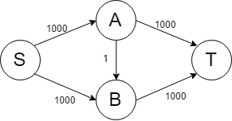

# 13. Summary of Graph

Outline
1. Weighted Graph: Find the Shortest Path
2. Directed Graph
3. Directed Graph: Reachability
4. Directed Graph: All Shortest Path
5. Directed Graph: Topological
6. Directed Graph: Strongly Connected
7. Network
8. Network: Activity on Edge(AOE)
9. Network: Network Flow
10. Network: Residual Network
11. Network: Ford-Fulkerson Algorithm(F-F Algorithm)
12. Network: Implement of F-F

## 1. Weighted Graph: Find the Shortest Path
- Accumulation of Weights
- Priority-First Search & Dijkstra Algorithm

### Priority-First Search
- save data of unvisited weight in heap
- heap : prioirty base datatype
```c
typedef struct _node {
	int vertex; // connected node
	int weight; // weight
	struct _node *next;
}node; // node of graph

node *graph[MAX_NODE]; // graph
int check[MAX_NODE]; // visited & unvisited & weight
int h[MAX_NODE]; // heap
int parent[MAX_NODE]; // parent node in spanning tree
int nheap = 0; // number of heap
```

#### Pseudo Code
1. Put the starting node into the queue
2. while(until all the nodes become the tree vertex (나무 정점))
   1. The smallest fringe vertex become the tree vertex V
   2. For connected nodes to V
      1. If the current vertex is a unseen vertex W (보이지 않는 정점),put the sum of weights from V and W into the queue
      2. If the current vertex is a fringe vertex W (주변 정점), put the smaller one between weights from V and W

#### Procedure

### Dijkstra Algorithm
- matrix graph 기반으로 실행됨.
- distance라는 배열에 start node에서 distance까지의 거리를 저장한다.

```c
int **map; // map(graph)
int *check; // visit & unvisit & weight
int *parent; // parent node in spanning tree
int *distance; // distance of startnode to index node
```

#### Pseudo Code
1. 시작 정점에 대해 모든 vertex에 대한 정보를 graph 내에서 가져온다.
   1. 이때, 해당 그래프들의 parent node는 시작 정점이라 가정한다.
2. 모든 정점를 방문할때까지
   1. 시작 정점에서 가장 짧은 거리에 있는 정점을 방문한다.
   2. 방문한 정점 주위에 있는 정점에 대해 정보를 업데이트 한다.


#### Procedure


## 2. Directed Graph
- Reachability
- All Shortest Path
- Topological
- Strongly Connected

## 3. Directed Graph: Reachability
- Search reachable node by BFS or DFS
- Warshall Algorithm
  - if AB and BC is connected, then it is same mean as AC is connected.
### Pseudo Code
- DFS or BFS
1. reset check state of all node
2. DFS(BFS)
3. if(check[index] == 1) index == reachable, else index != reachable

- Warshall

### Procedure

## 4. Directed Graph: All Shortest Path
- Floyd Algorithm
  - Dijkstra Algorithm ver. Directed Graph

### Pseudo Code

### Procedure


## 5. Directed Graph: Topological
- Directed Acyclic Graph: Graph without cycle -> all of spanning tree?
- Topological: Search the order of graph
  - Indegree: task to do first
- Reverse Topological: (알아서 보라고 하심)
  - Outdegree: task need to do next

### Pseudo Code
- Topological Search
  1. put node who's indegree == 0
  2. while(!stack_empty)
     1. pop and decrease indegree of available task
     2. put node who's indegree == 0

### Procedure

## 6. Directed Graph: Strongly Connected
- find loop(cycle) of Graph
- unable to use topological sorting
- **similar to Articulation Point**
- check change of stack

### Pseudo Code
- make spanning tree

### Procedure

## 7. Network
- Activity on Edge: difference of network! AOE vs AOV
- Network Flow
- Residual
- Ford-Fulkerson Algorithm
- Implement

## 8. Network: Activity on Edge(AOE)
- Earliest vs Latest
  - **Latest: require time**
  - Latest - Earliest = Loss
  - if Loss != 0 -> this way called Critical Path

  - Critical Path :

### Pseudo Code
- in edge <X,Y>
  - Earliest<Y>  : MAX weight to (X) + weight of <X,Y>
  - Latest<X> : MIN wieght to (Y) - weight of <X,Y>
1. for node A:
   1. if earliest<A> - latest<A> == 0: to A is not critical path

## 9. Network: Network Flow
- capacity : max weight
- flow : real weight
- (A -> C = 12) == (C -> A = -12)

## 10. Network: Residual Network
- residual = capacity - flow

## 11. Network: Ford-Fulkerson Algorithm(F-F Algorithm)
- find residual network by capacity network

### Pseudo Code
1. set zero for all flows in the network
2. while(augmenting path exists)
   1. min = minimum value among edges consisting of augmenting path
   2. Increase flow of the augmenting path by min
3. resdiual = capacity - flow

### Procedure

### Trouble Shooting

```text
SABT -> SBAT -> SABT -> SBAT ......
```

## 12. Network: Implement of F-F