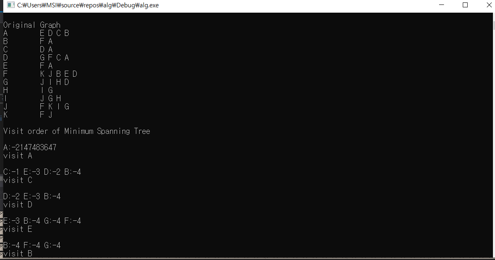
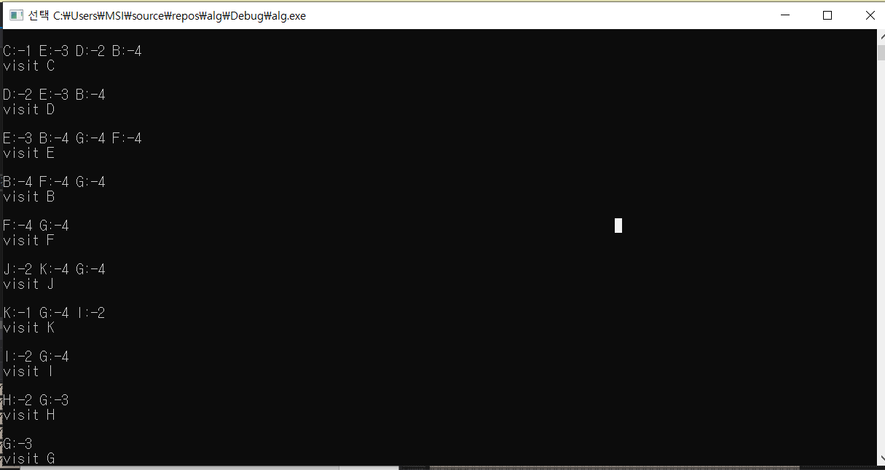
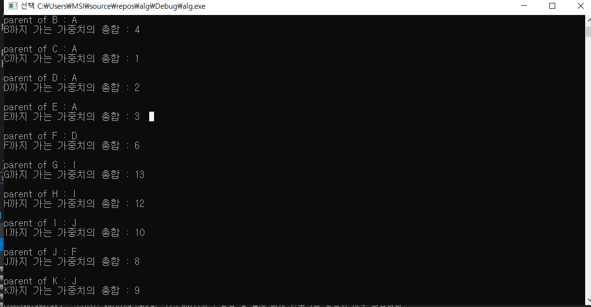

# Priority First Search

목차
1. 개요
2. 문제 정의
3. 추상화
4. 구현
5. 전체 코드 및 해석
6. 실행 결과 및 공간복잡도

## 1. 개요

 2019년 4월 11일 알고리즘 응용 수업에서 진행한 우선순위 우선 탐색을  구현해보고, 이에 더해 각 vertex의 parent vertex 및 root에서 rkr vertex까지의 거리를 출력해본다.
- 개발 환경
  - VS code : 문서 작성
  - Visual Studio

## 2. 문제 정의
1. 현재 탐색했던 edge 중 가장 우선순위가 낮은 edge를 어떻게 알 수 있는가?
2. 기존에 탐색했던 vertex를 목적지로 하는 edge가 다시 나왔을때, 이를 어떻게 처리할 것인가?
3. root에서 특정 vertex까지의 거리는 어떤 방식으로 구할것인가?

## 3. 추상화
1. 현재 탐색했던 edge 중 가장 우선순위가 낮은 edge를 어떻게 알 수 있는가?
    - vertex를 저장할 heap과 각 vertex까지의 weight를 저장할 check, 그리고 각 vertex의 parent vertex를 저장할 parent 총 세개의 자료형이 필요하다
      - down heap : heap 내에서 해당 node 기준으로 자식 노드들에 저장해둔 vertex num을 check에 제공. check에서 각 vertex 사이의 가중치를 가져오고, 이를 기반으로 가중치를 비교해 서로의 위치를 바꿀지 말지 결정한다.
      - up heap : heap 내에서 해당 node를 기준으로 parent node를 parent를 통해 check에 제공. check에서 각 vertex 사이의 가중치를 가져오고, 이를 기반으로 가중치를 비교해 서로의 위치를 바꿀지 말지 결정한다.
2. 기존에 탐색했던 vertex를 목적지로 하는 edge가 다시 나왔을때, 이를 어떻게 처리할 것인가?
   - check는 각각 vertex와 parent vertex 사이의 거리가 저장되어있다.
   - check에서 값을 가져와 새로운 edge와 기존 edge 사이의 가중치를 비교할 수 있다.
     1. 새로운 값이 더 작은 가중치를 가질 경우 : check, parent를 모두 새로운 값을 기준으로 변경한 후, heap 내에 leaf node를 제외한 모든 node들에 대해 down heap을 한번 실행한다.
     2. 새로운 값이 더 큰 가중치를 가질 경우 : 최단 경로가 아니므로 바꿀 필요가 없다.
3. root에서 특정 vertex까지의 거리는 어떤 방식으로 구할것인가?
   1. 재귀함수 형식 : root에서 특정 vertex 까지의 거리는 해당 vertex에서 parent vertex까지의 거리와 root에서 parent vertex까지의 거리의 합으로 나타낼 수 있다. 이를 통해 특정 vertex가 root가 될때까지 해당 함수를 반복한다.
   2. 비재귀함수 형식 : 현재 vertex를 나타내는 자료형(t)을 하나 생성한 후, t가 root가 될때까지 t와 parent vertex 사이의 가중치를 더한 후 t를 t의 parent vertex로 변경한다.
 ## 4. 구현
 - PFS Algorithm
    ```text
    parent : save parent vertex of each vertex
    check : save weight of each vertex(root : INT_MAX, unseened : -INT_MAX)
    heap : heap data

    while heap_empty :
        pop
        search all connected nodes
            1. unseened node : push and up heap
            2. seened node with smaller weight : change value and heap sorting
    ```
- 최단 경로(PFS)
    ```
    t : src vertex
    result : result
    root : dst vertex
    while t == root :
        result += check[t]
        t = parent[t] 
    ```
 ## 5. 전체 코드 및 해석
```c
#define _CRT_SECURE_NO_WARNINGS

#include<stdio.h>
#include<stdlib.h>
#define UNSEEN -INT_MAX
#define MAX_NODE 100
#define name2int(c) (c-'A')
#define int2name(c) (c+'A')


typedef struct _node {
	int vertex; // 연결되는 노드
	int weight; // 가중치
	struct _node *next;
}node;

node head[MAX_NODE];   // 그래프
int check[MAX_NODE];   // 가중치 저장
int h[MAX_NODE];   // 힙
int parent[MAX_NODE];   // 부모 노드 저장
int nheap = 0;
FILE *fp;   // 파일 읽어올때 사용함

void input_adjlist(node *a[], int *V, int *E);
// 그래프 설정 함수. 해당 코드에선 graph.txt를 받아 쓴다.
// a : graph, V : vertex size, E : edge size
void print_list(node *a[], int V);
// 프린트 출력 함수. 단 모든 값을 NULL까지 밀어버리므로 head를 복사해서 써야됨
// a : graph, V : vertex size
void pq_init();
// heap 초기화 함수
int pq_empty();
// heap 내의 데이터를 비우는 함수
void upheap(int *a, int k);
// up heap : 주어진 index를 기준으로 위로 올라가며 정렬
// a : heap, k : index num
void downheap(int *a, int k);
// down heap : 주아전 index를 기준으로 아래로 내려가며 정렬
// a : heap, k : index num
void insert(int *a, int *N, int v);
// heap에 데이터를 추가함
// a : heap, N : index size, v : weight
void adjust_heap(int h[], int n);
// 모든 index에 대해 down heap을 실행
// h : heap, n : index size
int pq_extract(int *a);
// root의 값을 뺴오는 함수
// a : heap
int pq_update(int h[], int v, int p);
// 1. 새로운 edge의 가중치가 기존 edge의 가중치보다 적을 경우 해당 node에 대한 queue의 edge를 새로운 edge로 바꿈
// 2. 만약 기존에 없던 node에 대한 edge가 있을경우, 해당 edge를 heap에 집어넣는다.
// h : heap, v : vertex num, p : weight
void PFS_adjlist(node *g[], int V);
// PFS알고리즘
// g : graph, V : vertex size
void visit(int i);
void print_heap(int h[]);
void print_cost(int weight[], int index);
int main() {
	int V, E;

	printf("\nOriginal Graph\n");
	input_adjlist(head, &V, &E);
	// get graph
	print_list(head, V);

	printf("\nVisit order of Minimum Spanning Tree\n");
	PFS_adjlist(head, V);
	// algorithm
	for (int i = 1; i < V; i++) {
		printf("\nparent of %c : %c", (char)i + 65, (char)parent[i] + 65);
		// print parent[]
		print_cost(parent, i);
		// get minimum cost of node i
		printf("\n");
	}
}

void input_adjlist(node *g[], int *V, int *E)
{
	char vertex[3];
	int i, j, w;
	node *t;

	fp = fopen("graph.txt", "r");

	fscanf(fp, "%d %d", V, E);
	for (i = 0; i < *V; i++)
		g[i] = NULL;
	for (j = 0; j < *E; j++) {
		fscanf(fp, "%s %d", vertex, &w);
		i = name2int(vertex[0]);
		t = (node *)malloc(sizeof(node));
		t->vertex = name2int(vertex[1]);
		t->weight = w;
		t->next = g[i];
		g[i] = t;
		i = name2int(vertex[1]);
		t = (node *)malloc(sizeof(node));
		t->vertex = name2int(vertex[0]);
		t->weight = w;
		t->next = g[i];
		g[i] = t;
	}
	fclose(fp);
}

void print_list(node *a[], int V) {
	// this function push all pointers of 'a' until NULL, so make same data  
	int i = 0;
	node *x = (node*)malloc(sizeof(node));
	while (i < V) {
		x = a[i];
		if (x) {
			printf("%c\t", i + 65);
			while (x) {
				printf("%2c", x->vertex + 65);
				x = x->next;
			}
			printf("\n");
			i++;
		}
	}
	free(x);
}

void print_heap(int h[]) {
	int i;
	printf("\n");
	for (i = 1; i <= nheap; i++)
		printf("%c:%d ", int2name(h[i]), check[h[i]]);
	// print heap 
}


void pq_init() {
	nheap = 0;
	// set node size of heap zero
}

int pq_empty() {
	if (nheap == 0) return 1;
	return 0;
	// if empty : true
	// else : false
}

void adjust_heap(int h[], int n) {
	int k;
	for (k = n / 2; k >= 1; k--)
		downheap(h, k);
	// downheap all nodes except leaf nodes
}

void upheap(int *a, int k) {
	int v;
	v = a[k];
	while (check[h[k / 2]] < check[v] && k / 2>0) {
	// if weight of children of k is smaller than weight of v,
	// ps. weight of unvisited nodes are minus
		a[k] = a[k / 2];
		k = k >> 1;
	}
	a[k] = v;
}

void downheap(int *a, int k) {
	// N : node number of tree
	int i, v;
	v = a[k];
	while (k <= nheap / 2) {
		i = k << 1;
		if (i < nheap&& check[a[i]] < check[a[i + 1]]) i++;
		if (check[v] > check[a[i]]) break;
		a[k] = a[i];
		k = i;

	}
	a[k] = v;
}

int pq_extract(int *a) {
	// get root node and down heap
	int v = a[1];
	a[1] = a[nheap--];
	downheap(a, 1);

	return v;
}

void insert(int *a, int *N, int v)
{
	a[++(*N)] = v;
	upheap(a, *N);
}

int pq_update(int h[], int v, int p)
{
	if (check[v] == UNSEEN) {
		// if node is unseend before
		h[++nheap] = v;
		check[v] = p; // store the weight
		upheap(h, nheap);
		return 1;
		// add new heap
	}
	else {
		if (check[v] < p) {
			// node is seened before and edge has smaller wieght
			check[v] = p;
			adjust_heap(h, nheap);
			// change edge of node
			return 1;
			
		}
		else
			return 0;
	}
}

void visit(int i) {
	printf("\nvisit %c\n", i + 65);
}

void PFS_adjlist(node *g[], int V)
{
	int i;
	node *t;
	pq_init();
	for (i = 0; i < V; i++) {
		check[i] = UNSEEN; // set nodes as unseen
		parent[i] = 0; // initialize a tree
	}
	// init check & parent
	for (i = 0; i < V; i++) {
		if (check[i] == UNSEEN)
			parent[i] = -1; // set the root
		pq_update(h, i, UNSEEN);
		// push i 
		while (!pq_empty()) {
			print_heap(h);
			// print current heap
			i = pq_extract(h);
			// pop root(heap[0]) of heap
			check[i] = -check[i];
			// if check > 0 -> visited node
			// else			-> unvisited node
			visit(i);
			// print current node
			for (t = g[i]; t != NULL; t = t->next)
				// while graph of current node is end
				if (check[t->vertex] < 0)
					// if node of graph is unvisited
					if (pq_update(h, t->vertex, -t->weight))
						// false : node of graph is unseened before
						// true : node of graph is seened before
						parent[t->vertex] = i;	// change parent node
		}
	}
}

void print_cost(int parent[], int index) {
	int i = index, result = 0;
	// needs to print index after, so make same data

	while (i > 0) {
	// while i > 0
		result += check[i];
		// add check(weight) of i at result
		i = parent[i];
		// change parent(i)
	}

	printf("\n%c까지 가는 가중치의 총합 : %d", (char)index + 65, result);
}
```

## 6. 실행 결과
- PFS
  
  
  - PFS의 경우, 제대로 작동하지만 가중치가 같은 edge 사이의 우선순의를 서로 다르게 설정해둬 결과가 다르다.
- weight
  

- path
  - 경로의 경우, 경로를 의미하는 stack을 하나 더 만들어주고 경로간의 거리를 계산하며 parent vertex를 하나씩 참조할 때 참조하는 모든 vertex를 stack에 하나씩 push해주는 방식으로 저장할 수 있다. 경로는 root에서 특정 vertex로 가는 방법을 의미하므로 FI/FO의 queue보단 FI/LO타입의 stack을 쓰는것이 더 낫다.
  ```c
  int path[MAX_NODE][MAX_NODE];
  // y축 : dst, x축 : src에서 dst로 갈때 방문하는 vertex를 모두 적어준다.
  ```