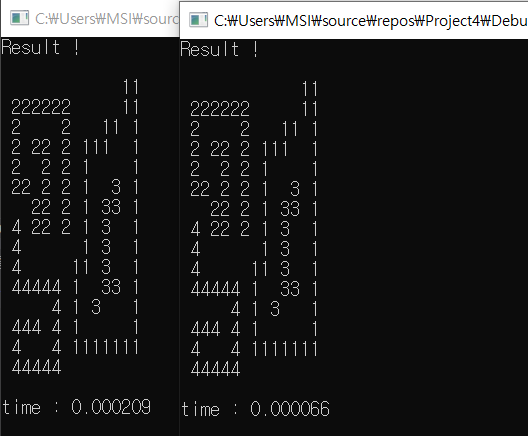
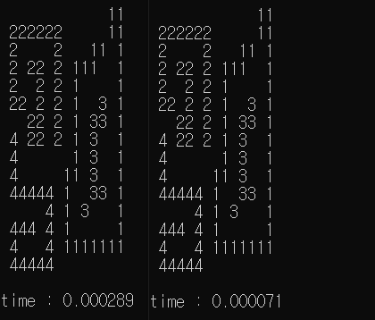

# CCA

목차
1. 개요
2. 문제 정의
3. 추상화
4. 전체 코드 및 해석
5. 실행 결과
6. Singularity

## 1. 개요
 주어진 배열에 대해 서로 다른 객체를 찾고, 이를 색칠하며 몇번째로 방문한 객체인지 찾아낼 수 있는 코드를 짜본다.

## 2. 문제 정의
1. 주어진 맵을 어떻게 나타낼 것인가?
2. 객체를 어떻게 구분할 것인가?
3. 같은 객체 내에서 어떤 방식으로 탐색할 것인가?
4. 이미 탐색된 객체와 아직 탐색되지 않은 객체를 어떻게 구분할 것인가?

## 3. 추상화
1. 주어진 맵을 어떻게 나타낼 것인가?
   - 2D array
     - 코드가 간단하다.
     - 참조하는데 오래걸린다.
   - 1D array
     - 코드가 약간 더 복잡하다.
     - 2D array보다 더 빠른 시간에 참조할 수 있다.
     - 첫번째 행과 마지막 행이 서로 붙어있는 상태로 인식된다. 따라서 추가적인 코드 조정이 필요하다.
        - 조정을 하지 않을 시, 아래의 그림과 같이 처음과 마지막이 연결되있다고 인식하는 문제가 발생한다.
            
            
   - 1D array로 구현하는 것을 목표로 한다.
2. 객체를 어떻게 구분할 것인가?
   - 배경은 0, 객체는 0이 아닌 다른 수라 가정한다.
   - 만약 탐색 도중 0이 아닌 다른 수를 만났을때, 이를 객체라 인식한다.
   - 객체를 탐색할 때, 각 픽셀에 대해 8방향 탐색을 한다면 총 8\*15\*15 = 1800번 탐색을 하는 것이 되므로 비효율적이다.
   - 따라서 객체를 아직 발견하지 못 했을땐 좌에서 우로, 위에서 아래로 탐색을 한다.
3. 같은 객체 내에서 어떤 방식으로 탐색할 것인가?
   - 교수님께서 제시해주신 대로, 8방향 탐색을 하다 이어진 부분을 만나면 현재까지의 상황을 저장한 후 해당 부분으로 넘어간다.
4. 이미 탐색된 객체와 아직 탐색되지 않은 객체를 어떻게 구분할 것인가?
   - 탐색된 객체와 탐색되지 않은 객체의 배열 내의 값을 서로 다르게 설정해준다.
   - 이미 탐색된 객체의 경우, 배열 내의 값을 탐색된 순서로 설정한다. 단, 이때 해당 값은 탐색되지 않은 객체가 보유하고 있는 값과 달라야한다.

## 4. 전체 코드 및 해석
``` c++
#include<stdio.h>
#include<stdlib.h>
#include<Windows.h>
// 시간을 재기 위해 window 헤더파일 사용

#define SIZE 15
// 배열의 크기
#define BACKGROUND 0
// 배경을 0이라 설정
#define CONNECTED 1
// 1의 의미 1 : 이어져있다
#define NEW_OBJECT 1
// 1의 의미 2 : 새로운 객체이다.
#define NORTH 1
// 북 : 1 
#define NORTHEAST 2
// 북동 : 2
#define EAST 4
// 동 : 4
#define SOUTHEAST 8
// 남동 : 8
#define SOUTH 16
// 남 : 16
#define SOUTHWEST 32
// 남서 : 32
#define WEST 64
// 서 : 64
#define NORTHWEST 128
// 북서 : 128. shift연산을 통해 방향을 바꾸기 때문에 2씩 곱해준다.
#define tail NULL
// tail을 NULL로 설정.
#define BYTE unsigned char
// 요구 데이터가 크지 않을땐 1바이트 변수를 사용한다.

typedef struct _node {
    int x;
    int y;
    // x와 y 값의 최대치는 size에 따라 달라지므로 유동적이다. 따라서 int형으로 선언
    BYTE dir;
    // 방향은 8가지 이상으로 구분할 필요 없다. 따라서 byte형으로 선언
}node;

BYTE bitmap[SIZE*SIZE] = {
0,0,0,0,0,0,0,0,0,0,0,0,1,1,0,
0,1,1,1,1,1,1,0,0,0,0,0,1,1,0,
0,1,0,0,0,0,1,0,0,0,1,1,0,1,0,
0,1,0,1,1,0,1,0,1,1,1,0,0,1,0,
0,1,0,0,1,0,1,0,1,0,0,0,0,1,0,
0,1,1,0,1,0,1,0,1,0,0,1,0,1,0,
0,0,0,1,1,0,1,0,1,0,1,1,0,1,0,
0,1,0,1,1,0,1,0,1,0,1,0,0,1,0,
0,1,0,0,0,0,0,0,1,0,1,0,0,1,0,
0,1,0,0,0,0,0,1,1,0,1,0,0,1,0,
0,1,1,1,1,1,0,1,0,0,1,1,0,1,0,
0,0,0,0,0,1,0,1,0,1,0,0,0,1,0,
0,1,1,1,0,1,0,1,0,0,0,0,0,1,0,
0,1,0,0,0,1,0,1,1,1,1,1,1,1,0,
0,1,1,1,1,1,0,0,0,0,0,0,0,0,0
};
// 제공된 map. %c을 통해 출력할것이므로 0~128까지의 숫자만 표기할 수 있으면 된다.
BYTE color = 48;
// 48은 char형으로 출력했을때 0이 된다. 이후 탐색 순서가 주어진 색이 되도록 코드를 구성했다.
int stack[SIZE*SIZE];
// 최대 225개의 원소가 stack에 들어갈 수 있도록 설정해준다. 또한 이후 구조체의 포인터를 저장할 것이므로 int형 혹은 node*형으로 선언해준다.
int top;

node* new_node(int i, int j) {
    node *t = (node*)malloc(sizeof(node));
    t->x = j;
    t->y = i;
    t->dir = NORTH;
    return t;
}
// i를 y좌표, j를 x좌표로 갖는 새로운 node를 생성

void init_stack(void);
// stack 초기화

void CCA();
// 새로운 객체 탐색 알고리즘

void Search(int i, int j);
// 같은 객체의 색상을 바꿔주는 함수.

void push(node *pre);
// stack에 주어진 구조체의 주소을 push하는 함수.

void change_color(node* crd);
// 주어진 위치의 색을 바꾸는 함수

node* pop();
// pop

int stack_empty();
// stack이 비어있으면 1을 반환

int bitmap_coord(int i, int j, BYTE dir);
// 비트맵 내에서 방향에 맞는 좌표 계산

void print_bitmap() {
    for (int i = 0; i < SIZE; i++) {
        for (int j = 0; j < SIZE; j++) {
            printf("%c", bitmap[i*SIZE + j]);
        }
        printf("\n");
    }
}
// bitmap 출력 함수


int main(void) {
    LARGE_INTEGER freq, start, stop;
    double diff;
    // 시간 측정용 변수들

    printf("Back Ground(0) : \"%c\", Line(1) : \"%c\" \n", BACKGROUND, NEW_OBJECT);
    // 기본 설정들 출력
    printf("Color of Line is reference order\n\n");
    // 참조 순서는 해당 객체의 출력값
    printf("Provided Bitmap ! \n\n");
    print_bitmap();
    // 주어진 배열을 출력

    QueryPerformanceFrequency(&freq); // computer frequency
    QueryPerformanceCounter(&start); // starting point
    // 알고리즘 수행 전 시작 지점 설정
    
    CCA();
    // 알고리즘 수행
    QueryPerformanceCounter(&stop); // stopping point
    diff = (double)(stop.QuadPart - start.QuadPart) / freq.QuadPart;
    // 끝지점 설정 후 경과 시간 계산

    printf("\nResult ! \n\n");
    print_bitmap();
    // 결과 출력

    printf("\ntime : %f\n", diff);
    // 소요 시간 출력
}

int bitmap_coord(int i, int j, BYTE dir) {
    int result = -1;
    // 각각 8방향에 해당하는 좌표값을 반환한다.
    switch (dir) {
    case NORTH:
        result = (i - 1)*SIZE + j;
        break;
    case NORTHEAST:
        result = (i - 1)*SIZE + j + 1;
        break;
    case EAST:
        result = i * SIZE + j + 1;
        break;
    case SOUTHEAST:
        result = (i + 1)*SIZE + j + 1;
        break;
    case SOUTH:
        result = (i + 1)*SIZE + j;
        break;
    case SOUTHWEST:
        result = (i + 1)*SIZE + j - 1;
        break;
    case WEST:
        result = i * SIZE + j - 1;
        break;
    case NORTHWEST:
        result = (i - 1)*SIZE + j - 1;
        break;
    default:
        printf("\nERROR\n");
    }
    return result;
    // 해당되는 것이 하나도 없으면 곧 dir값이 8방향이 아니라는 뜻이므로 음수를 리턴.
}

void init_stack() {
    top = -1;
}

int stack_empty() {
    return top < 0;
}

void push(node *pre) {
    stack[++top] = (int)pre;
    // 매개변수로 주어진 구조체의 주소를 stack에 저장. 다만 자료형이 다르므로 캐스팅을 해준다.
}

node* pop() {
    return (node*)(stack[top--]);
    // 저장해뒀던 값을 반환한다. int값을 반환하므로 캐스팅을 해준다.
}

void CCA() {
    int i, j;
    for (i = 0; i < SIZE; i++)
        for (j = 0; j < SIZE; j++)
            if (bitmap[i*SIZE + j] == NEW_OBJECT)
            // 만약 새 객체(1)를 발견하면 서로 이어진 값들을 찾는다.
                Search(i, j);
}

void change_color(node* cur) {
    bitmap[cur->y*SIZE + cur->x] = color;
    // 해당 좌표의 값을 color로 바꿈
}


void Search(int i, int j) {
    int coord;
    // 좌표 계산할때 사용
    node *push_node, *cur;
    // push_node : 현재 node 주변에 있는 bitmap값이 1인 곳
    // cur : 현재 노드
    node *head = new_node(i, j);

    init_stack();
    push(head);

    color++;
    // 새로운 객체를 발견할때마다 color(참조 순서)는 증가
    while (!stack_empty()) {
        cur = pop();
        change_color(cur);
        // 현재 위치의 bitmap 값을 바꿈
        while (cur->dir > 0) {
        // unsigned char은 0~255까지의 값을 가지므로 8번 이상 shift하면 overflow가 일어나 0으로 고정된다.
        // 8방향에 대해
            coord = bitmap_coord(cur->y, cur->x, cur->dir);
            // 각 방향에 맞는 좌표 계산
            if (bitmap[coord] == CONNECTED) {
            // 해당 좌표가 1이면(연결되있으면)
                push_node = new_node(coord / SIZE, coord % SIZE);
                // stack에 집어넣을 새로운 node를 생성
                push(cur);
                push(push_node);
                // 현재 위치와 새로운 node를 stack에 집어넣는다.
                break;
                // 새로운 위치에 대한 탐색을 해야하므로 while문에서 빠져나온다.
            }
            if ((cur->dir == SOUTH && cur->x == 0) || (cur->dir == NORTH && cur->x == SIZE - 1))
            // 1D array의 문제점 : 처음과 마지막 줄의 경우, 서로 이어져있다고 판단하기 때문에 방향을 여러번 shift해줘야한다.
                cur->dir = cur->dir << 4;
            else
            // 그 외엔 한번만 shift
                cur->dir = cur->dir << 1;
		}
        if (cur->dir == 0)
        // 만약 빠져나와서 현재 cur->dir값이 0이면 해당 node는 더이상 쓸모가 없다는 의미이다. 따라서 동적 할당을 해제해줌
            free(cur);		
            // 할당 해제의 경우, 메모리를 보다 효율적으로 사용할 수 있지만, 조건문이 하나 붙어 프로그램 실행 시간은 약간 늘어난다.
	}
}
```

## 5. 실행 결과
- 수행 결과
  
      
  - 0 -> character형으로 NULL이므로 공백을 출력한다.
  - 1 -> 꺽쇠 출력
  - 디폴트 color값을 '0'으로 설정하고, 새로운 객체를 발견할때마다 1씩 증가시킨다.

## 6. Singularity
- 실제로 1차원 배열과 2차원 배열 모두 활용해 구현해봤지만, 눈에 보일정도로 속도가 차이나진 않았다.
- 다만, 출력창을 닫지 않고 코드를 재실행했을때, 속도가 눈에 띄게 빨라졌다.
  - 1D array : 좌측이 최초 결과, 우측이 2번째 결과
 
    
  - 2D array
 
    
  - 수행 결과, 1D array는 2번째 실행시간이 54~70정도의 값이 주로 나오는 반면, 2D array는 65~80의 값이 나왔다.
  - 다만, 하나의 출력창을 켜둔 상태로 다시 코드를 실행시킬 경우, 어째서 더 짧은 시간이 걸리는지는 알 수 없었다.