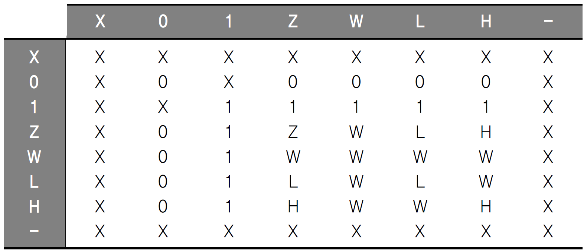

# 응용 논리 회로

## 3. 데이터 타입

Outline
- 기정의된 데이터 타입

### 기정의된 데이터 타입

- BIT : 2레벨 논리(0,1)
  - SIGNAL x : BIT;
    - bit 단일
  - SIGNAL y : BIT_VERTOR( 3 DOWNTO 0);
    - [3:0] 배열
  - SIGNAL w : BIT_VECTPR( 0 TO 7);
    - [0:7] LSB와 MSB가 뒤집어진 배열
  - x <= '1';
  - y <= "0111";
  - w <= "01110001";

- STD_LOGIC : IEEE 1164 표준 안에 소개된 8레벨의 논리 체계
  - 'X' : Forcing Unknown
  - '0' : Forcing LOW
  - '1' : Forcing HIGH
  - 'Z' : Hight Impedance
  - 'W' : Weak Unknown
  - 'H' : Weak Hight
  - '-' : Don't Care
  - 'U' : Undefined -> 초기화하지 않았을떄 주로 발생.
  - SIGNAL x : STD_LOGIC;
  - SIGNAL y : STD_LOGIC_VECTOR (3 DOWNTO 0);
  - 각 논리체계는 정해진 연산법이 있다.
  
