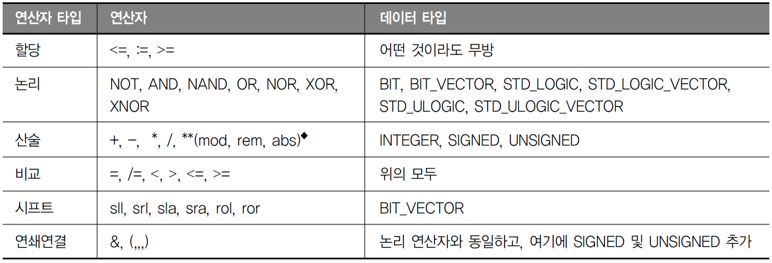

# 응용논리회로
## 4. 연산자

Outline
1. 연산자
2. 속성

## 1. 연산자

- 할당 연산자 : <=
  - 산호, 변수, 상수에 값을 할당하기 위해 사용

- 논리 연산자 
  - not, and, or, nand, nor, xor, xnor
  - 이전 논리회로에 쓰던 연산 그대로 사용

- 산술 연산자
  - +, -, *, /
  - signed 혹은 unsigned 중 하나의 자료형만 사용할경우, 뺄셈과 덧셈 연산에 STD_LOGIC_VECTOR 직접 사용 가능.

- 비교 연산자
  - =, <, >, /=, <=, >=
  - 비교 연산 수행을 위해 사용
  - 피연산자 데이터는 어떤 타입도 사용 가능

- 시프트 연산자
  - sll : shift left logic
  - srl : shift right logic
  - sla : shift left arithmetic
  - sra : shift right arithmetic
  - rol : rotate left logic
  - rer : rotate right logic

